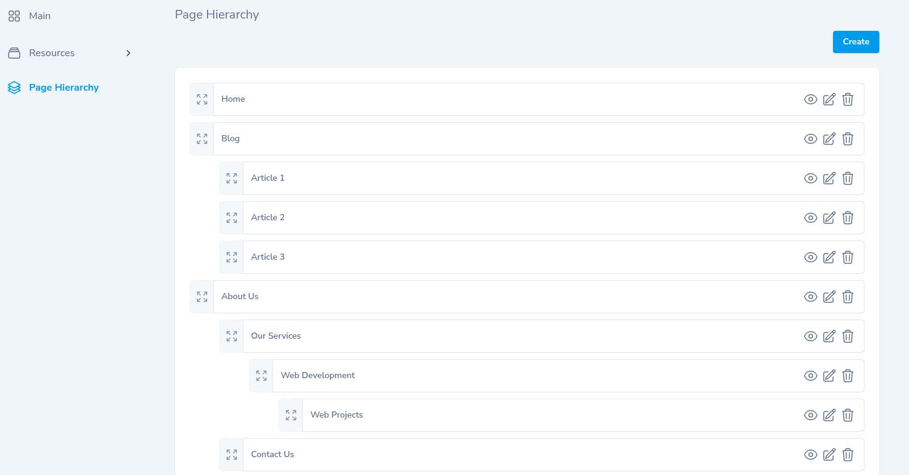

# Nova Resource Hierarchy

[](https://packagist.org/packages/bencolmer/nova-resource-hierarchy)


This package allows you to display and manage resource hierarchy in a tree view within [Laravel Nova](https://nova.laravel.com).



## Features:

- Drag-and-drop nesting and reordering
- A large number of [configuration options](#configuration)
- [Laravel Authorization](https://laravel.com/docs/master/authorization) support
- Localization support

## Requirements

### Installation Requirements

- `php: >=8.1`
- `laravel/nova: ^5.0`

### Model Requirements

This package requires your model's database table to have the following columns:

| Column Name | Description |
| ----------- | ----------- |
| id | The model's primary key column |
| parent_id | A self-referencing foreign key column |
| rank | A column recording the order of the hierarchy *(optional - only required if [enabling reordering](#enable-reordering))* |


You can customize the names of these columns - see [customizing model keys](#customizing-model-keys) below for details.

## Installation

1. Install this package via composer:


```bash
composer require bencolmer/nova-resource-hierarchy
```

2. Register the tool with Laravel Nova via the `tools` method of the  `NovaServiceProvider`.

```php
// in app/Providers/NovaServiceProvider.php

use BenColmer\NovaResourceHierarchy\ResourceHierarchy;

// ...

public function tools()
{
    return [
        // ...

        ResourceHierarchy::make(\App\Nova\MyResource::class),
    ];
}
```

Next, take a look through the available [configuration options](#configuration).

## Configuration

Once you have registered the tool in Nova, you have several configuration options available:

### Customizing Model Keys

Set the ID, Parent ID, and order column *(optional)* names for the underlying model of a resource.


```diff
public function tools()
{
    return [
        ResourceHierarchy::make(\App\Nova\MyResource::class),
+           ->keyNames('idColumnName', 'parentIdColumnName', 'orderColumnName')
    ];
}
```

### Enable Reordering

Enables reordering of the resource hierarchy (this functionality is disabled by default).


```diff
public function tools()
{
    return [
        ResourceHierarchy::make(\App\Nova\MyResource::class),
+           ->enableReordering()
    ];
}
```

### Maximum Depth

Set the maximum hierarchy depth.

```diff
public function tools()
{
    return [
        ResourceHierarchy::make(\App\Nova\MyResource::class),
+           ->maxDepth(3)
    ];
}
```

### Available Actions

You can control which actions (Create, View, Update, and Delete) are available.

By default, the View, Edit, and Delete actions are available. These actions are protected by authorization controls.

```diff
public function tools()
{
    return [
        ResourceHierarchy::make(\App\Nova\MyResource::class),
+           ->actions(['create', 'view', 'update', 'delete'])
    ];
}
```

### Menu Entry

You can customize the menu entry title/icon:

```diff
public function tools()
{
    return [
        ResourceHierarchy::make(\App\Nova\MyResource::class),
+           ->menuTitle('This will be the menu title')
+           ->menuIcon('globe-alt')
    ];
}
```

Alternatively, you can hide the menu entry entirely:


```diff
public function tools()
{
    return [
        ResourceHierarchy::make(\App\Nova\MyResource::class),
+           ->hideMenu()
    ];
}
```

### Page Title/Description

You can customize the title of the page and set a description (optional).


```diff
public function tools()
{
    return [
        ResourceHierarchy::make(\App\Nova\MyResource::class),
+           ->pageTitle('Manage Hierarchy')
+           ->pageDescription('Manage the resource hierarchy below.')
    ];
}
```

### Item Title

You can customize the title of each item displayed in the hierarchy.

By default, the ["title" of the resource](https://nova.laravel.com/docs/v5/search/global-search#title-%2F-subtitle-attributes) will be displayed.


```diff
use Illuminate\Database\Eloquent\Model;

// ...

public function tools()
{
    return [
        ResourceHierarchy::make(\App\Nova\MyResource::class),
+           ->formatItemTitle(fn(Model $item) => implode(' - ', ([$item->id, $item->name])))
    ];
}
```

## Authorization

This package uses Laravel's [authorization policies](https://nova.laravel.com/docs/v5/resources/authorization#policies) to control Create / View / Update / Delete permissions.

You can also define one further authorization method to control whether a user is authorized to reorder the resource hierarchy:

1. Apply the `AuthorizesHierarchy` trait to your Nova resource:


```diff

// in app/Nova/MyResource.php

+ use BenColmer\NovaResourceHierarchy\Traits\AuthorizesHierarchy;

// ...

class MyResource extends Resource
{
+    use AuthorizesHierarchy;

    // ...
}
```

2. Define a `reorderHierarchy` method on your Policy class:

```diff

// in app/Policies/MyResourcePolicy.php

// ...

class MyResourcePolicy
{
+    /**
+     * Determine whether the user can reorder the hierarchy.
+     */
+    public function reorderHierarchy(User $user): bool
+    {
+        return true; // check if the user is authorized
+    }

    // ...
}
```

## Localization & Message Customization

The package translation files can be published using the following command:

```bash
php artisan vendor:publish --provider="BenColmer\NovaResourceHierarchy\ToolServiceProvider" --tag=translations
```

You can then edit these files to customize the messages as required.

## Credits

- [Ben Colmer](https://github.com/bencolmer)
- [Ralph Huwiler (vue-nestable)](https://github.com/rhwilr/vue-nestable)
- [Artem Stepanenko (vue3-nestable)](https://github.com/stepanenko3/vue3-nestable)

## License

Nova Resource Hierarchy is open-sourced software licensed under the [MIT license](LICENSE.md).
